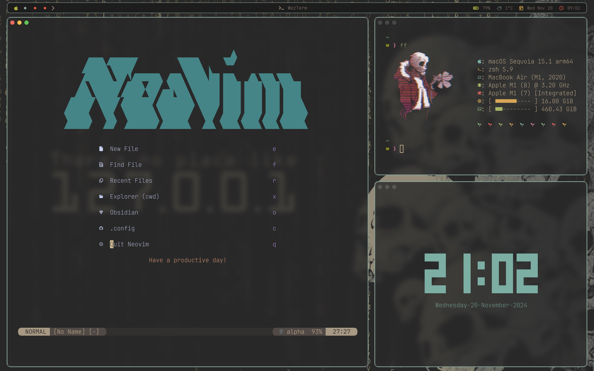

# Backup meiner Dotfiles mit git stow





Dies ist mein persönliches Repository für Dotfiles. Es enthält Konfigurationen für verschiedene Tools und Programme, die ich täglich benutze. Dieses Repository ist so eingerichtet, dass es mit GNU Stow verwaltet wird, um die Konfigurationen einfach auf andere Systeme zu übertragen.

## Installation auf einem neuem System

### Voraussetzungen

1. Git
Stelle sicher das git installiert ist:

```bash
sudo apt install git      # Ubuntu/Debian
sudo pacman -S git        # Arch
brew install git          # macOS
```

2. GNU Stow
Installiere GNU Stow, um die Symlinks für die Dotfiles zu verwalten

```bash
sudo apt install stow     # Ubuntu/Debian
sudo pacman -S stow       # Arch
brew install stow         # macOS
```

### Schritte zur Installation

1. Repository klonen
Klone das Dotfiles-Repository in dein Home-Verzeichnis oder einen gewünschten Ordner:

```bash
git clone https://github.com/Neo3477/dotfiles.git ~/dotfiles
cd ~/dotfiles
```

2. Konfiguration einrichten
Benutze GNU Stow, um die gewünschten Konfigurationen zu installieren:

```bash
stow tmux       # Installiert die Tmux-Konfiguration
stow zsh        # Installiert die Zsh-Konfiguration
stow nvim       # Installiert die Neovim-Konfiguration
stow sketchybar # Installiert die Sketchybar-Konfiguration (Nur für MacOS)
stow aerospace  # Installiert die Aerospace-Konfiguration (Nur für MacOS)
....
```

Jeder Befehl erstellt Symlinks von den Dotfiles im Repository zu den entsprechenden Orten im Home-Verzeichnis.

>[!ATTENTION]
>Sketchybar
>Damit das Weather Script funktioniert, braucht man einen API Key
>den bekommt man hier: https://www.weatherapi.com/
>der Key + City muss in eine weather.env.sh eingetragen werden
>und sollte im Ordner scripts liegen

```bash
KEY=your API Key
CITY=your City
```

>[!TIP]
>Das install Script bietet zwei Möglichkeiten:
>install.sh -m (für MacOS) und
>install.sh -l (für Linux, auf Arch Basis es wird pacman genutzt)
>bei der Installation für Linux wird Sketchybar und Aerospace NICHT installiert


